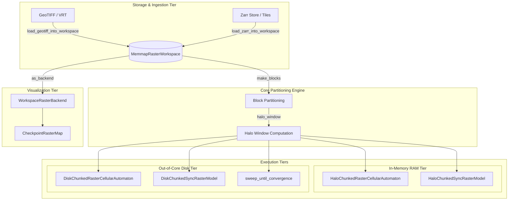

# `haloexec` Documentation

Welcome to the comprehensive documentation for **`haloexec`**, a high-performance execution engine for large-scale geospatial Cellular Automata (CA) and spatial models using **Domain Decomposition** with **Halo Zones** (Ghost Cell Pattern).

---

## Documentation Navigation

This documentation is organized into modular guides covering foundational theory, software architecture, complete API specifications, and end-to-end practical tutorials:

1. [**Theory and Core Concepts**](file:///home/sergio/develop/github/lambdageo/haloexec/docs/theory_and_concepts.md)  
   *Detailed mathematical, algorithmic, and computational foundations.*  
   Domain decomposition, ghost cell exchange, multi-hop spatial dependency reach, external boundary sentinel pitfalls, virtual memory and POSIX sparse disk memmaps, double-buffering race conditions, iterative Gauss-Seidel convergence, and Zarr axis-ordering anomalies.

2. [**Architecture and Design Patterns**](file:///home/sergio/develop/github/lambdageo/haloexec/docs/architecture.md)  
   *Software design and structural mechanics.*  
   Layered decoupling (zero-dependency core engine vs. ecosystem adapters), cooperative multiple inheritance via Python's Method Resolution Order (MRO), runtime backend-swapping pattern, and memory-mapped double-buffer slot lifecycle.

3. [**API Reference**](file:///home/sergio/develop/github/lambdageo/haloexec/docs/api_reference.md)  
   *Exhaustive interface specification for all modules, classes, and functions.*  
   Signatures, parameter descriptions, invariants, return types, exceptions, and side effects across RAM, disk, I/O, convergence, and visualization subsystems.

4. [**Tutorials and Practical Recipes**](file:///home/sergio/develop/github/lambdageo/haloexec/docs/tutorials_and_recipes.md)  
   *Step-by-step implementation walkthroughs.*  
   Building in-memory chunked CAs, executing out-of-core billion-cell models, windowed GeoTIFF/VRT ingestion, multi-tile Zarr assimilation, unbounded connectivity propagation, and memory profiling (`RssAnon` vs. `RssFile`).

---

## Overview & Mission

In geospatial modeling and complex systems simulation (e.g., land-use and land-cover change [LUCC], tidal hydrology, mangrove migration, wildland fire propagation), spatial grids frequently exceed available physical RAM. For example, high-resolution national or regional grids can encompass tens or hundreds of millions—even billions—of cells.

Traditional execution engines process such grids **monolithically**: the entire spatial array is held in RAM, and neighborhood operations (e.g., focal sums, directional shifts) are computed globally. When the domain cannot fit into memory, the simulation fails with an out-of-memory (OOM) error or suffers thrashing due to unmanaged swap paging.

`haloexec` solves this challenge by providing:
- **Zero-Cognitive-Overhead Integration**: Maintains 100% contract parity with base models (such as `dissmodel`'s `RasterCellularAutomaton` and `SyncRasterModel`). Scientists do not rewrite their transition rules or equations.
- **Strict Domain Decomposition**: Partitions arbitrary 2D rasters into manageable computational blocks.
- **Ghost Cell Pattern (Halo Padding)**: Seamlessly stitches local block boundaries so that neighborhood operations across block partitions evaluate identically to monolithic runs.
- **Out-of-Core Disk Execution**: A zero-dependency disk workspace built on memory-mapped files (`numpy.memmap`) and double-buffering, allowing billion-cell simulations on standard hardware.
- **Iterative Convergence Orchestration**: A block-wise Gauss-Seidel engine for unbounded spatial dependencies (e.g., hydrological connectivity and flow routing) that cannot be resolved with fixed-depth halos.

---

## Architectural Map



---

## Quickstart

### 1. In-Memory Chunked Simulation

When the domain fits into RAM, but you want to enforce block-wise processing or prepare for scaling:

```python
import numpy as np
from dissmodel.core import Environment
from dissmodel.geo.raster.backend import RasterBackend
from haloexec import HaloChunkedRasterCellularAutomaton

class GameOfLife(HaloChunkedRasterCellularAutomaton):
    def rule(self, arrays: dict[str, np.ndarray]) -> dict[str, np.ndarray]:
        state = arrays["state"]
        neighbors = self.backend.focal_sum_mask(state == 1)
        born = (state == 0) & (neighbors == 3)
        survive = (state == 1) & np.isin(neighbors, [2, 3])
        return {"state": np.where(born | survive, 1, 0).astype(np.uint8)}

# Allocate global domain
backend = RasterBackend(shape=(2000, 2000))
backend.set("state", np.random.randint(0, 2, (2000, 2000), dtype=np.uint8))

env = Environment(start_time=1, end_time=20)
GameOfLife(backend=backend, block_h=500, block_w=500, halo=1)
env.run()
```

### 2. Out-of-Core Disk-Backed Simulation

When the domain exceeds physical memory, initialize a [`MemmapRasterWorkspace`](file:///home/sergio/develop/github/lambdageo/haloexec/src/haloexec/disk/workspace.py#L81) and run out-of-core:

```python
from pathlib import Path
import numpy as np
from dissmodel.core import Environment
from haloexec import (
    MemmapRasterWorkspace,
    DiskChunkedRasterCellularAutomaton,
)

class LargeScaleGameOfLife(DiskChunkedRasterCellularAutomaton):
    def rule(self, arrays: dict[str, np.ndarray]) -> dict[str, np.ndarray]:
        state = arrays["state"]
        neighbors = self.backend.focal_sum_mask(state == 1)
        born = (state == 0) & (neighbors == 3)
        survive = (state == 1) & np.isin(neighbors, [2, 3])
        return {"state": np.where(born | survive, 1, 0).astype(np.uint8)}

# Allocate out-of-core workspace (50,000 x 50,000 = 2.5 Billion cells)
ws = MemmapRasterWorkspace.create(
    root=Path("/tmp/sim_workspace"),
    shape=(50_000, 50_000),
    arrays={"state": np.uint8},
    block_h=1024,
    block_w=1024,
    halo=1,
)

env = Environment(start_time=1, end_time=5)
LargeScaleGameOfLife(workspace=ws)
env.run()
ws.flush()
```
