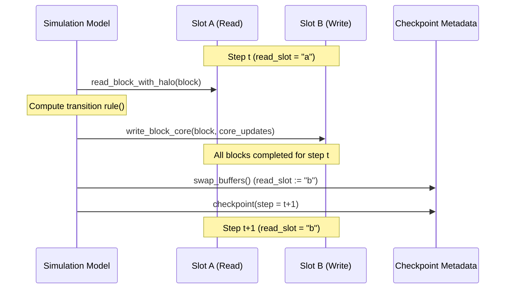

# Theory and Core Concepts

`haloexec` provides a rigorous execution environment for spatial simulations and Cellular Automata (CA) on arbitrary two-dimensional raster grids. This document establishes the formal mathematical, algorithmic, and computational foundations governing the engine.

---

## 1. Domain Decomposition for Raster Automata

### 1.1 Mathematical Formulation
Consider a discrete two-dimensional spatial domain $\Omega$ defined as a bounded integer lattice:

$$\Omega = \{ (r, c) \in \mathbb{Z}^2 \mid 0 \le r < H, \; 0 \le c < W \}$$

where $H$ is the total domain height (rows) and $W$ is the total domain width (columns). A state variable $A$ on $\Omega$ is a mapping:

$$A: \Omega \to \mathcal{S}$$

where $\mathcal{S}$ represents the state space (e.g., $\mathcal{S} \subseteq \mathbb{R}$ for elevation, or $\mathcal{S} \subseteq \{0, 1, \dots, K-1\}$ for categorical land-use classes).

In **Domain Decomposition**, $\Omega$ is partitioned into a set of non-overlapping rectangular sub-domains (blocks) $\mathcal{B} = \{ B_{i, j} \}$:

$$B_{i, j} = [r_{0}^{(i)}, r_{1}^{(i)}) \times [c_{0}^{(j)}, c_{1}^{(j)})$$

such that:

$$\bigcup_{i, j} B_{i, j} = \Omega \quad \text{and} \quad B_{i, j} \cap B_{i', j'} = \emptyset \quad \forall (i, j) \neq (i', j')$$

### 1.2 Regular Decomposition with Edge Residue
Given target block dimensions $(b_h, b_w)$, the grid coordinates for block indices $i \in \{0, \dots, \lceil H / b_h \rceil - 1\}$ and $j \in \{0, \dots, \lceil W / b_w \rceil - 1\}$ are:

$$\begin{aligned}
r_{0}^{(i)} &= i \cdot b_h, & r_{1}^{(i)} &= \min((i + 1) \cdot b_h, H) \\
c_{0}^{(j)} &= j \cdot b_w, & c_{1}^{(j)} &= \min((j + 1) \cdot b_w, W)
\end{aligned}$$

Blocks situated at the southern ($r_1 = H$) or eastern ($c_1 = W$) boundaries naturally accommodate residual dimensions when $H \not\equiv 0 \pmod{b_h}$ or $W \not\equiv 0 \pmod{b_w}$ without requiring dummy cell insertions or coordinate transformations ([Xia et al., 2025](https://doi.org/10.3390/ijgi14030109)).

---

## 2. The Ghost Cell Pattern (Halo Zones)

### 2.1 Theoretical Foundations
In spatial models and cellular automata, the state update of cell $(r, c)$ at time step $t + \Delta t$ depends on the states of cells in its local neighborhood $\mathcal{N}(r, c)$ at time $t$:

$$A^{(t+\Delta t)}(r, c) = \mathcal{R}\left( \left\{ A^{(t)}(r', c') \mid (r', c') \in \mathcal{N}(r, c) \right\} \right)$$

When the domain is partitioned, evaluating $\mathcal{R}$ for cells along the perimeter of block $B_{i, j}$ requires values belonging to adjacent neighbor blocks $B_{i \pm 1, j \pm 1}$.

The **Ghost Cell Pattern** ([Kjolstad & Snir, 2010](https://doi.org/10.1145/1953611.1953615)) solves this spatial coupling by augmenting each local sub-domain $B_{i, j}$ with a perimeter of boundary cells—termed **ghost cells** or a **halo zone**—of width $h$:

$$B_{i, j}^{\text{halo}} = [r_{0}^{(i)} - h, \; r_{1}^{(i)} + h) \times [c_{0}^{(j)} - h, \; c_{1}^{(j)} + h)$$

```
+-----------------------------------------------------------+
| External Boundary Halo (Filled with boundary_value)      |
|   +---------------------------------------------------+   |
|   | Internal Ghost Cells (Copied from neighbor blocks)|   |
|   |   +-------------------------------------------+   |   |
|   |   |                                           |   |   |
|   |   |             Core Block Domain             |   |   |
|   |   |              (r0:r1, c0:c1)               |   |   |
|   |   |         Updated by rule() evaluation      |   |   |
|   |   |                                           |   |   |
|   |   +-------------------------------------------+   |   |
|   |   |                                           |   |   |
|   +---+-------------------------------------------+---+   |
+-----------------------------------------------------------+
```

### 2.2 Core vs. Halo Regions
During execution:
1. **Extraction**: A window corresponding to $B_{i, j}^{\text{halo}}$ is populated with state data at time $t$.
2. **Local Evaluation**: The transition function $\mathcal{R}$ executes over the full expanded window of shape $(b_h + 2h, b_w + 2h)$.
3. **Core Trimming**: The outermost $h$ rows and columns of the output are discarded, retaining strictly the updated core $[h : -h, \; h : -h]$ of shape $(b_h, b_w)$.
4. **Reconciliation**: The updated core is committed to the destination state buffer at slice $[r_0 : r_1, \; c_0 : c_1]$.

Because the boundary cells in the halo zone absorb all spatial stencil edge-effects, the computed core is mathematically and bit-identically equivalent to evaluating the global monolithic domain.

---

## 3. Spatial Dependency Reach & Multi-Hop Hazards

A frequent error in distributed and block-partitioned spatial modeling is equating the halo depth $h$ directly to the nominal shift radius of an elementary spatial operator.

### 3.1 The Multi-Hop Dependency Theorem
Let an elementary spatial operator $\mathcal{O}_k$ have spatial stencil radius $R(\mathcal{O}_k)$. If a model transition function $\mathcal{R}$ is composed of a sequence of dependent spatial transformations:

$$\mathcal{R} = \mathcal{O}_m \circ \mathcal{O}_{m-1} \circ \dots \circ \mathcal{O}_1$$

where intermediate spatial field $F_k = \mathcal{O}_k(F_{k-1})$ is consumed by $\mathcal{O}_{k+1}$, the **effective spatial dependency reach** $R^*$ of the transition function is the sum of the radii across all dependent stages:

$$R^* = \sum_{k=1}^{m} R(\mathcal{O}_k)$$

To guarantee boundary equivalence with a monolithic execution, the halo depth must satisfy:

$$h \ge R^*$$

### 3.2 Real-World Case Study: The `FloodModel` 2-Hop Hazard
During empirical validation against the TerraME golden dataset for the Maranhão Island (323 $\times$ 349 cells), setting $h = 1$ produced 91 divergent elevation cells at step 1, escalating to 1,431 divergent cells at step 19.

**Root Cause Analysis:**
In `FloodModel`, the algorithm proceeds as follows:
1. **Stage 1 (1-hop stencil)**: For each cell $(r, c)$, compute `viz_baixos`—the count of Moore neighbors $(r \pm 1, c \pm 1)$ whose elevation is $\le$ cell $(r, c)$.
2. **Stage 2 (Local algebraic)**: Compute `fluxo(r, c)` as a function of `viz_baixos(r, c)`.
3. **Stage 3 (2-hop stencil)**: Update the elevation and state of cell $(r, c)$ by inspecting `fluxo(r \pm 1, c \pm 1)`—the *flux of the neighbor*.

Because the update at cell $(r, c)$ requires the neighbor's flux, which itself required the neighbor's neighbors, information propagates across a Manhattan distance of 2 cells in a single time step ($R^* = 2$).

With $h = 1$, the ghost cells at the block border had incorrect `fluxo` values because their outer neighbors were zero-padded by local directional shifting. This corrupted flux then infected the valid core cells adjacent to the border. Setting $h = 2$ fully resolved the divergence, achieving 100% equivalence.

```
Cell (r, c) in Core
     └── depends on Neighbor (r+1, c) in Halo Ring 1
              └── depends on Outer Neighbor (r+2, c) in Halo Ring 2
```

> [!WARNING]
> **The Synthetic Boundary Test Trap**: When testing spatial models using idealized synthetic rasters where sources (such as sea borders or forest boundaries) are placed exclusively along the outer domain edges, multi-hop halo errors remain hidden. This occurs because the outer edge of the domain is subject to external boundary padding in both monolithic and chunked modes. Multi-hop dependency bugs only manifest when feature gradients cross **internal block boundaries**.

---

## 4. Boundary Conditions & The "Zero-Sentinel" Pitfall

When a block touches the physical perimeter of the global domain $\Omega$, part of its halo zone falls outside the domain:

$$(r, c) \notin \Omega$$

These external ghost cells must be populated using an external boundary condition.

### 4.1 The Danger of Default Zero Padding
A ubiquitous practice in numerical computing is zero-padding (`np.pad(..., constant_values=0)`). In geospatial modeling, **scalar zero is frequently a valid, meaningful state**:
- In elevation rasters (`alt`), `0.0` represents mean sea level.
- In coastal models (e.g., BR-MANGUE), `solo = 0` denotes `SOLO_CANAL_FLUVIAL` (active river channel), which serves as a seed for mangrove colonization.

If unmanaged, zero-padding external boundaries injects artificial river channels or sea-level cells along the edge of the study area, generating phantom colonization and divergent model dynamics.

### 4.2 Per-Array Sentinel Mapping
`haloexec` prevents this failure via [resolve_boundary_value](../src/haloexec/engine.py#L55):
- `boundary_value` accepts a dictionary mapping array names to their true domain `nodata` sentinel:
  ```python
  boundary_value = {"uso": 0, "alt": -9999.0, "solo": -1}
  ```
- **Temporal State Fallback**: When temporal synchronization creates historical arrays (e.g., `solo_past`), `resolve_boundary_value("solo_past")` automatically resolves to the base configuration for `solo` (`-1`) if not explicitly specified. This eliminates subtle bugs where historical arrays inadvertently revert to `0`.

---

## 5. Out-of-Core Computation & Memory Management

When scaling to regional or national extents (e.g., a 40,000 $\times$ 40,000 grid encompassing 1.6 billion cells, or 6.4 GB per float32 layer), allocating global in-memory NumPy arrays or performing global `np.pad` results in immediate Out-Of-Memory (OOM) termination.

### 5.1 Memory-Mapped I/O (`numpy.memmap`)
[`MemmapRasterWorkspace`](../src/haloexec/disk/workspace.py#L81) stores spatial arrays directly on the filesystem as uncompressed binary disk files (`.dat`) accessed through POSIX `mmap()` system calls.

Under `mmap`:
1. The kernel maps the file on disk into the virtual address space of the process.
2. No physical RAM is allocated until specific virtual addresses are accessed.
3. Accessing a block triggers hardware page faults; the kernel OS page cache loads only the requested 4 KiB memory pages from disk into RAM.
4. When memory pressure increases, dirty pages are asynchronously flushed to storage and clean pages are evicted from physical RAM automatically by the kernel.

### 5.2 Decoupling Heap (`RssAnon`) from Kernel Page Cache (`RssFile`)
Traditional memory profilers report total Resident Set Size (`VmRSS` or `ru_maxrss`). For memory-mapped applications, this metric is deceptive:

$$\text{VmRSS} = \text{RssAnon} + \text{RssFile}$$

- **`RssAnon` (Anonymous RSS)**: Process heap memory (Python objects, local block arrays). This represents true memory retained by the program.
- **`RssFile` (File-backed RSS)**: OS page cache mirroring touched disk pages. This memory is dynamically reclaimed by the operating system whenever physical RAM is needed elsewhere.

**Benchmark Evidence**:  
In a 40,000 $\times$ 40,000 Conway's Game of Life simulation (1.6 billion cells per step), benchmarked in a memory-constrained 3.9 GB RAM container:
- Total file data touched: $> 3.2\text{ GB}$
- Peak `RssAnon`: **$\sim 130\text{ MB}$**
- Net `RssAnon` delta throughout run: **$\sim 4\text{ MB}$**

This proves that `haloexec`'s memory footprint is $O(b_h \cdot b_w)$—proportional strictly to the block size, and **strictly independent of the global domain size** $H \times W$.

### 5.3 Filesystem Sparsity Economics
When creating new arrays, [`MemmapRasterWorkspace.create()`](../src/haloexec/disk/workspace.py#L145) uses `mode="w+"` to truncate and set the file length without writing zeros across the disk blocks.

On modern filesystems (ext4, XFS, APFS, NTFS), this creates **POSIX sparse files**:
- Unwritten disk blocks occupy zero physical storage on disk.
- Reads to unwritten regions return zeros directly from the kernel without disk I/O.
- Disk usage scales only with cells that have been explicitly written.

> [!IMPORTANT]
> **The Dense Fill Tradeoff**: Sparsity benefits are lost if an ingestion loader fills unmapped or ocean blocks with a dense sentinel value such as `np.nan` or `-9999.0`. To preserve sparse disk allocation, empty blocks should be omitted during ingestion, provided that `0` is an acceptable default representation for absent data.

---

## 6. Race Conditions & State Synchronization

### 6.1 Read-After-Write (RAW) Data Hazards
In a synchronous Cellular Automaton, every cell's state at step $t+1$ must depend strictly on the state of its neighborhood at step $t$. If blocks were updated in place sequentially:

$$\text{Block}_2 \text{ reads from } \text{Block}_1 \text{ at } t+1 \quad \implies \quad \text{Spatial Hazard!}$$

A cell along the boundary of $\text{Block}_2$ would observe neighbor cells in $\text{Block}_1$ that have already transitioned to step $t+1$, violating temporal synchrony and corrupting simulation dynamics.

### 6.2 Logical Double-Buffering (Ping-Pong Architecture)
`haloexec` eliminates RAW hazards through physical double-buffering. For every registered array, two physical files exist:
- Slot `a`: `/path/to/workspace/a/{name}.dat`
- Slot `b`: `/path/to/workspace/b/{name}.dat`

The execution protocol proceeds as follows:



Buffer swapping is purely logical: it modifies an in-memory pointer (`read_slot`) and updates an atomic JSON checkpoint file. No disk copying occurs.

### 6.3 Temporal Replication: The `_past` Synchronization Problem
Many sophisticated ecological models (such as `SyncRasterModel` in `dissmodel`) retain previous-step states in designated `<name>_past` arrays to model multi-stage temporal feedback (e.g., accretion based on previous year's elevation).

In monolithic in-memory frameworks, synchronization is implemented as:
```python
backend.arrays["alt_past"] = backend.arrays["alt"].copy()
```
If applied naively to a disk-backed memory-mapped workspace, this call would materialize the entire multi-gigabyte array in RAM, crashing the system.

`haloexec` resolves this via [write_block_to_read_slot](../src/haloexec/disk/workspace.py#L269):
1. Historical arrays `<name>_past` are allocated directly within both disk slots.
2. In `pre_execute()` and `post_execute()`, synchronization copies data **block-by-block** directly within the **active read slot**:
   $$\text{Slot}_{\text{read}}[name\_past][block] \longleftarrow \text{Slot}_{\text{read}}[name][block]$$
3. During the block loop, when updates are written to the write slot, any `<name>_past` array not modified by the current model is carried forward to preserve continuity across buffer swaps.

---

## 7. Unbounded Spatial Dependencies (Iterative Sweeps)

### 7.1 Limitations of Fixed-Depth Halos
Certain spatial processes cannot be bounded by a finite, localized halo radius:
- **Tidal / Marine Connectivity**: Water penetrates inland through dendritic tidal creeks. A cell 50 kilometers inland might depend on ocean connectivity across thousands of intermediate cells.
- **Hydrological Flow Routing & Basin Delineation**: D8 flow direction routing accumulates downstream across an entire drainage basin.

Resolving these dynamics with a static halo would require setting $h = \max(H, W)$, degenerating into a monolithic execution that exhausts memory.

### 7.2 Gauss-Seidel Iterative Convergence
For these unbounded processes, [`sweep_until_convergence`](../src/haloexec/disk/convergence.py#L46) replaces the fixed halo ping-pong mechanism with an **iterative relaxation sweep**:
- Uses a minimal halo ($h = 1$).
- Traverses all blocks in the domain repeatedly.
- Updates are written **immediately in-place** to the active read buffer via [write_block_core_in_place](../src/haloexec/disk/workspace.py#L279).

```
Sweep k:
  Block(0,0) updates → written immediately to Slot
  Block(0,1) reads Block(0,0)'s NEW output immediately (Gauss-Seidel acceleration)
  ...
Sweep k+1:
  Repeats until zero blocks change across an entire domain sweep.
```

### 7.3 Monotonicity and Convergence Guarantee
Let the transition rule be represented as a vector operator $T: \mathcal{S}^{|\Omega|} \to \mathcal{S}^{|\Omega|}$. 

If $T$ is **monotone** with respect to a partial order $\le$ on the state space:

$$X \le Y \implies T(X) \le T(Y)$$

and the state space $\mathcal{S}$ is finite (e.g., binary connectivity $\{0, 1\}$ where states only transition from $0 \to 1$), then:
1. By the Knaster-Tarski fixed-point theorem, the sequence of sweeps is guaranteed to terminate at a unique least fixed point $X^* = T(X^*)$.
2. Gauss-Seidel ordering strictly accelerates convergence compared to Jacobi (ping-pong) updating because newly activated paths propagate across multiple blocks within a single global sweep.
3. The worst-case number of sweeps is bounded by $|\mathcal{B}| + 1$ (the total number of blocks plus one verification sweep).

---

## 8. Spatial Ingestion & Coordinate Anomalies

### 8.1 GeoTIFF Windowed Streaming
Rather than loading large GeoTIFF or VRT rasters monolithically into memory, [`load_geotiffs_into_workspace`](../src/haloexec/disk/io/geotiff.py#L74) maps each block's bounding box to a `rasterio.windows.Window`:

$$\text{Window}(\text{col\_off} = c_0, \; \text{row\_off} = r_0, \; \text{width} = c_1 - c_0, \; \text{height} = r_1 - r_0)$$

Data streams directly from disk into the corresponding block slice of the memory-mapped file, maintaining peak RAM usage within tens of megabytes.

### 8.2 The Zarr v3 Axis-Ordering Anomaly
When ingesting data cubes from modern cloud stores (such as `disscube` or xarray datasets stored via `to_zarr()`), array dimensions do not have a guaranteed physical disk axis order of `(y, x)`:
- Some datasets are serialized as `(x, y)` or `(time, x, y)`.
- If a raster is **square** ($H = W$), comparing shape tuples:
  $$\text{shape}(arr) = (N, N) \equiv (N, N)$$
  fails to detect inverted axes. This causes silent, catastrophic transpose corruption (e.g., swapping latitude and longitude).

To safeguard data integrity, [`load_zarr_into_workspace`](../src/haloexec/disk/io/zarr.py#L86) interrogates native Zarr v3 dimension metadata (`arr.metadata.dimension_names`):
1. Resolves actual dimension positions: e.g., identifying whether `"y"` is at axis 0 or axis 1.
2. Generates canonical index projections during chunk extraction.
3. Automatically transposes extracted sub-arrays to standard `(y, x)` canonical orientation before committing blocks to the workspace.
